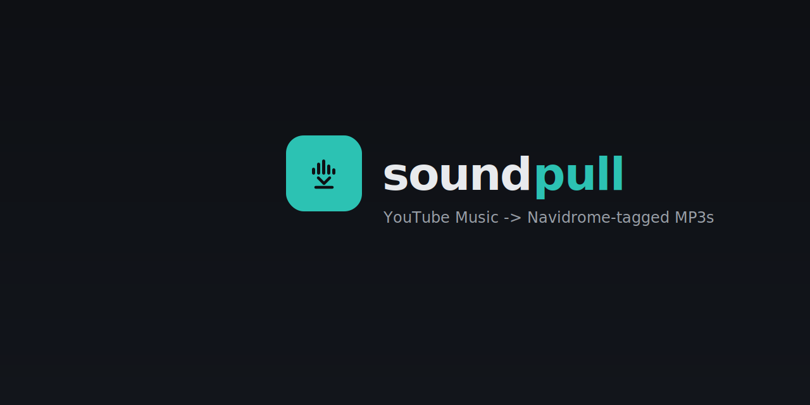
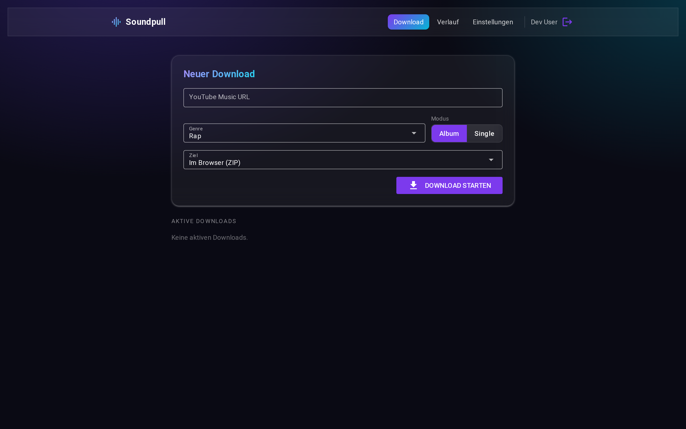
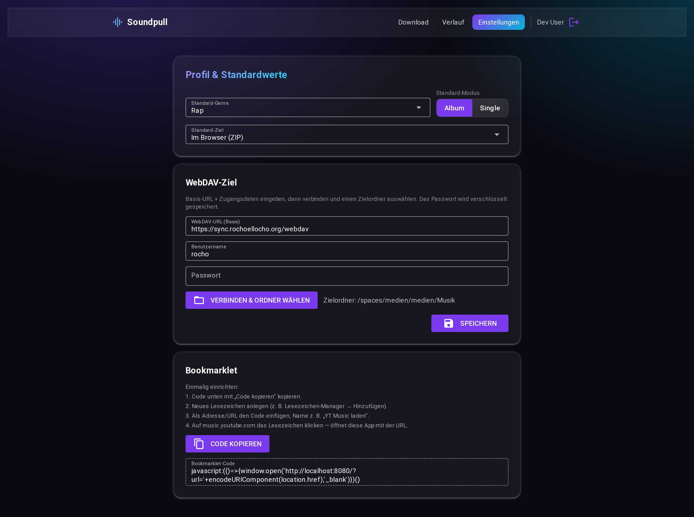

<p align="center">
  
</p>

<p align="center">
  <a href="https://github.com/Rocho-EL-Locho/soundpull/actions/workflows/ci.yml"></a>
  <a href="https://github.com/Rocho-EL-Locho/soundpull/actions/workflows/docker-publish.yml"></a>
  <a href="LICENSE"></a>
  
</p>

**Soundpull turns YouTube Music links into properly tagged audio — MP3 or the original Opus/M4A.**

Paste a link to an album, single or playlist, and Soundpull downloads it in the quality and
format you choose (MP3 320 / 192 kbps, or the original Opus/M4A stream with no re-encode),
cleans up the metadata (artist, album artist, title, track number, genre, square cover art)
so it looks right in music servers like [Navidrome](https://www.navidrome.org/) — and you
decide which of those fields it actually writes. It then hands the result to you either as a
**ZIP download in your browser** or by uploading it **straight to your own WebDAV storage**.
Playlists can even be **subscribed** so Soundpull re-syncs them on a schedule, pulling in
only the tracks you don't already have.

It's a small, self-hosted web app meant to run on your own server. Access is protected
by **single sign-on (authentik / OIDC)**, and every user gets their own profile, default
settings and download history.

## Screenshots

| Download | Settings |
|:--:|:--:|
|  |  |

## Features

- 🎵 **Albums & singles** — paste any YouTube Music URL
- 📃 **Playlists** — download a whole playlist as a Navidrome-importable `.m3u8`; each track
  keeps its own tags, and you can pick **“no genre”** so mixed-artist lists aren't forced to one
- 🔁 **Playlist sync (subscriptions)** — subscribe a playlist and Soundpull re-syncs it on a
  configurable interval to your WebDAV, fetching **only tracks not already on your server**
- 🎚️ **Choose quality & format** — MP3 320 or 192 kbps, or the **original** Opus/M4A stream
  with no re-encode (best fidelity, smallest file)
- 🏷️ **Clean, consistent tags** — feat. artists, album artist, title cleanup, track number,
  genre and square cover art, tuned for Navidrome (and compatible with most players)
- 🎛️ **Pick which tags to write** — toggle each field (genre, album artist, cover art, track
  number, feat-artist cleanup, comments) on or off, as a default or per download; a field
  turned off is left out of the file entirely
- 📦 **Flexible delivery** — download as a ZIP in the browser, or upload directly to a
  WebDAV target you pick from a built-in folder browser
- 🌍 **Bilingual UI** — switch the interface between English and German
- 🔐 **Protected** — login via authentik (OIDC); optionally restrict to a group
- 🍪 **Your own YouTube cookie** — optionally store a `cookies.txt` (encrypted, per user) to
  download age-gated / region-locked tracks and get past "confirm you're not a bot" prompts
- 👤 **Per-user** — personal defaults, WebDAV credentials (encrypted) and history
- 📊 **Live progress** — watch each download move through its stages in real time
- 🔖 **Bookmarklet** — one click on a YouTube Music page opens Soundpull with the URL filled in

## How it works

```
Browser ──HTTPS──▶ Reverse proxy ──▶ Soundpull (web app)
                                       ├─ login via authentik (OIDC)
                                       ├─ per-user profiles & history
                                       └─ yt-dlp ─▶ tag cleanup ─▶ ZIP download | WebDAV upload
```

Under the hood it drives [yt-dlp](https://github.com/yt-dlp/yt-dlp) for the download and a
dedicated tagging step for the metadata. Built with [NiceGUI](https://nicegui.io/) (Python).

For playlist subscriptions, an in-process scheduler periodically checks which subscriptions
are due and re-syncs them. Soundpull keeps a per-user index of what it has delivered to your
server (by artist + title, seedable by scanning your WebDAV target), so each sync downloads
only the newly added tracks instead of the whole playlist.

## Quick start (Docker)

1. Create an **OAuth2/OIDC application** in authentik with redirect URI
   `https://<your-host>/auth/callback` and scopes `openid email profile`.
2. Configure the app:
   ```bash
   cp .env.example .env
   # then fill in the values — see Configuration below
   ```
3. Adjust the host rule / TLS resolver in `docker-compose.yml` and start it:
   ```bash
   docker compose up -d --build
   ```

### Run locally (no authentik)

```bash
python -m venv .venv && .venv/bin/pip install .
.venv/bin/python -m app.main   # http://localhost:8080
```

If the `OIDC_*` variables are unset, login falls back to a local **dev user** so you can
try the UI without an authentik instance.

## Configuration

Set via environment / `.env` (see `.env.example`):

| Variable | Purpose |
|---|---|
| `APP_BASE_URL` | Public URL of the app (redirect URIs, bookmarklet) |
| `SESSION_SECRET` | Signs the session cookie |
| `FERNET_KEY` | Encrypts stored secrets at rest (WebDAV passwords, YouTube cookies) |
| `OIDC_DISCOVERY_URL`, `OIDC_CLIENT_ID`, `OIDC_CLIENT_SECRET`, `OIDC_REDIRECT_URI` | authentik OIDC |
| `OIDC_SCOPES` | *(optional)* OIDC scopes (default `openid email profile`) |
| `OIDC_ALLOWED_GROUP` | *(optional)* restrict access to a group |
| `OIDC_POST_LOGOUT_REDIRECT` | *(optional)* where authentik sends the user after logout |
| `DATABASE_URL` | SQLite database location (default `sqlite:///./data/app.db`) |
| `LOCAL_MUSIC_ROOT` | Staging/temp directory for downloads |
| `MAX_CONCURRENT_DOWNLOADS` | How many downloads run at once |
| `MAX_PLAYLIST_ITEMS` | *(optional)* Cap on tracks fetched from one playlist (0 = unlimited) |
| `SYNC_ENABLED` | *(optional)* Enable the background playlist-sync scheduler (default on) |
| `SYNC_TICK_SECONDS` | *(optional)* How often the scheduler checks for due subscriptions |
| `WEBDAV_ALLOWED_HOSTS` | *(optional)* SSRF guard: comma-separated allowlist of WebDAV hosts (empty = no restriction) |

## Usage

1. Open the app and sign in.
2. Paste a YouTube Music URL (or use the bookmarklet from **Settings**).
3. Pick the audio quality/format, genre, mode (album / single / playlist), and the destination
   (browser ZIP or WebDAV) — and, if you like, expand **Metadata fields** to override which
   tags get written for this download.
4. Start — follow the live progress; the ZIP download starts automatically when done.

In **Settings** you set your defaults (genre, quality/format, destination, and which metadata
fields to write), pick the interface language, and, for WebDAV, connect and browse to a target
folder. Your WebDAV password is stored encrypted.

### Playlist sync (subscriptions)

Under **Subscriptions** you can have Soundpull keep a playlist up to date automatically. Add a
playlist URL, choose how often to sync (e.g. every 6/12/24 h or weekly), and pick what the
first run should do:

- **Download everything now** — fetch the whole playlist immediately, then only new tracks after.
- **Mark as already present** — treat the current playlist as already on your server (no
  download), so only tracks added *later* are pulled in.

Subscriptions deliver to WebDAV, so a WebDAV target must be configured first. To recognise
tracks you already have (e.g. downloaded before subscribing), use **Settings → Scan server**
once to index your existing library. Each subscription shows its live status, last sync and
how many new tracks it added.

### YouTube cookie (for restricted tracks)

Some tracks are age-gated, region-locked, or trip YouTube's "Sign in to confirm you're not a
bot" check. To download those, store your own YouTube cookie in **Settings → YouTube cookie**:

1. In your browser (signed in to YouTube), export a `cookies.txt` with a Netscape-format
   cookie extension such as **Get cookies.txt LOCALLY**.
2. Paste the file's contents into the **YouTube cookie** field and save.

The cookie is [Fernet-encrypted](SECURITY.md) at rest (requires `FERNET_KEY`), is never shown
back to you, and is used only for your own downloads. Toggle **Remove stored cookie** to delete it.

## Tech stack

NiceGUI (FastAPI) · Authlib (OIDC) · SQLModel + SQLite · yt-dlp · mutagen · webdav4 ·
Docker + Traefik.

## License

[MIT](LICENSE)
