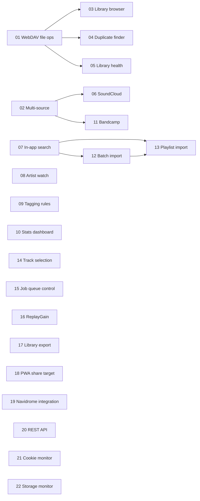

# Soundpull Roadmap — from downloader to music-library manager

**Vision:** Soundpull today is a YouTube-Music downloader with Navidrome tagging and
WebDAV delivery. This roadmap turns it into a tool to **manage and grow** a personal
music library: browse it, keep it clean (duplicates, metadata health), and feed it from
more sources (SoundCloud, in-app search, artist tracking).

Baseline for all documents: **v0.10.0** (line numbers in the docs are approximate for
that version — always trust file paths + function names over line numbers).

## How to use this folder (for the implementing agent)

Each feature lives in its own numbered folder:

- `spec.md` — *what & why*: goal, current state, scope (in/out), UX, acceptance criteria
- `implementation.md` — *how*: touch points (files/functions), data model, step plan, tests

Workflow for one feature:

1. Read [CONVENTIONS.md](CONVENTIONS.md) **fully** — especially the metadata-parity
   invariant. It is non-negotiable.
2. Read the feature's `spec.md`, then `implementation.md`.
3. Check **Depends on** in the spec — do not start before dependencies are merged to `main`.
4. Explore the referenced files first; the implementation plan tells you *where*, the
   code tells you *how it really looks today*.
5. Implement on a branch off `main` (it is protected), add/extend tests, run the full
   test suite, then open a PR from the repo template. Reference the linked GitHub issue
   if the spec names one.

Features **within the same phase are independent of each other** (unless a dependency is
stated) and can be implemented by parallel agents on separate branches.

## Phases & features

| # | Feature | Phase | Effort | Depends on | GitHub issue |
|---|---------|-------|--------|------------|--------------|
| 01 | [WebDAV file operations + trash](01-webdav-file-ops/spec.md) | 1 — Foundation | M | — | — |
| 02 | [Multi-source architecture](02-multi-source/spec.md) | 1 — Foundation | M | — | — |
| 03 | [Library browser](03-library-browser/spec.md) | 2 — Manage | L | 01 | — |
| 04 | [Duplicate finder & cleanup](04-duplicate-finder/spec.md) | 2 — Manage | L | 01 | — |
| 05 | [Library health check](05-library-health/spec.md) | 2 — Manage | L | 01 | — |
| 06 | [SoundCloud support](06-soundcloud/spec.md) | 3 — Grow | M | 02 | [#30](https://github.com/Rocho-EL-Locho/soundpull/issues/30) |
| 07 | [In-app YouTube Music search](07-in-app-search/spec.md) | 3 — Grow | M | — | [#41](https://github.com/Rocho-EL-Locho/soundpull/issues/41) |
| 08 | [Artist watch & discography gaps](08-artist-watch/spec.md) | 3 — Grow | M | — | — |
| 09 | [Configurable tagging rules](09-tagging-rules/spec.md) | 4 — Comfort | S–M | — | [#8](https://github.com/Rocho-EL-Locho/soundpull/issues/8) |
| 10 | [Statistics dashboard](10-stats-dashboard/spec.md) | 4 — Comfort | S | — | — |
| 11 | [Bandcamp support](11-bandcamp/spec.md) | 3 — Grow | S–M | 02 | — |
| 12 | [Batch import from track list](12-batch-import/spec.md) | 3 — Grow | M | 07 | — |
| 13 | [Spotify / Apple Music playlist import](13-playlist-import/spec.md) | 3 — Grow | L | 07, 12 | — |
| 14 | [Track selection before download](14-track-selection/spec.md) | 4 — Comfort | M | — | — |
| 15 | [Job queue control (cancel / reorder)](15-job-queue-control/spec.md) | 4 — Comfort | M | — | — |
| 16 | [ReplayGain tagging (opt-in)](16-replaygain/spec.md) | 4 — Comfort | M | — | — |
| 17 | [Library export & backup](17-library-export/spec.md) | 2 — Manage | S | — | — |
| 18 | [PWA + share target](18-pwa-share-target/spec.md) | 5 — Integrate | S–M | — | — |
| 19 | [Navidrome integration](19-navidrome-integration/spec.md) | 5 — Integrate | S–M | — | — |
| 20 | [REST API + API keys](20-rest-api/spec.md) | 5 — Integrate | M | — | — |
| 21 | [Cookie health monitor](21-cookie-monitor/spec.md) | 6 — Resilience | S | — | — |
| 22 | [Storage monitor & space guard](22-storage-monitor/spec.md) | 6 — Resilience | S–M | — | — |

## Dependency graph

## Why this order

- **Phase 1** builds the two missing foundations: nothing in the codebase can *modify*
  the remote library today (only upload + list), and the pipeline is hard-wired to
  YouTube. Both are pure-backend, low-risk, and unblock everything else.
- **Phase 2** is the "manage your collection" promise: see what you have, find and
  remove duplicates, fix metadata problems — all built on the phase-1 file operations.
- **Phase 3** is the "grow your collection" promise: new source (SoundCloud), less
  friction (in-app search), automation (artist watch).
- **Phase 4** is comfort/polish and can be slotted in anytime.
- **Phase 5** makes Soundpull play with the outside world: install it on a phone
  (PWA share target), let Navidrome know about new music immediately, and open the
  job machinery to automation (REST API).
- **Phase 6** is operational robustness: catch an expired YouTube cookie and a full
  disk **before** they silently degrade downloads.

Feature numbers are creation order, not priority — the **Phase** column is the
grouping that matters. New features added later simply continue the numbering.

## Versioning & releases

Baseline: **v0.10.0**. The repo convention stays: every merged feature PR bumps the
**minor** version (`0.x.0 → 0.(x+1).0`), pure fixes bump the patch. Features can merge
in any order within their phase, so a feature does not own a fixed version number —
the version is "next free minor at merge time". What IS fixed are the **milestones**:
a milestone is reached when all its features are merged, and the *expected* version
below assumes one minor bump per feature.

| Milestone | Features | Expected version | Meaning |
|---|---|---|---|
| M1 — Foundation | 01, 02 | **v0.12** | remote files are manageable; sources are pluggable |
| M2 — Library manager | 03, 04, 05, 17 | **v0.16** | browse, dedup, heal, export — the "manage" promise delivered |
| M3 — Multi-source | 06, 11 | **v0.18** | SoundCloud + Bandcamp usable end-to-end |
| M4 — Import & search | 07, 12, 13 | **v0.21** | search in-app, import lists and Spotify/Apple playlists |
| M5 — Automation & comfort | 08, 09, 10, 14, 15, 16 | **v0.27** | artist watch, track selection, queue control, tagging comfort |
| M6 — Integrated | 18, 19, 20 | **v0.30** | phone share target, Navidrome hook, REST API |
| M7 — Ops-hardened → **v1.0.0** | 21, 22 | **v1.0.0** | cookie + storage guards in place |

**v1.0.0 criteria** (the last milestone releases as 1.0.0 instead of another 0.x):
all 22 features merged; no known data-loss bugs; duplicate finder and health check
verified against a real production library; metadata-parity suite green; a fresh
`docker compose up` from README instructions works end-to-end.

If a feature is dropped or deferred, shift the expected versions down accordingly —
milestones are content-defined, not date- or number-defined.

## Status

Track progress by checking items off here when the PR is merged:

- [ ] 01 WebDAV file operations + trash
- [ ] 02 Multi-source architecture
- [ ] 03 Library browser
- [ ] 04 Duplicate finder & cleanup
- [ ] 05 Library health check
- [ ] 06 SoundCloud support
- [ ] 07 In-app YouTube Music search
- [ ] 08 Artist watch & discography gaps
- [ ] 09 Configurable tagging rules
- [ ] 10 Statistics dashboard
- [ ] 11 Bandcamp support
- [ ] 12 Batch import from track list
- [ ] 13 Spotify / Apple Music playlist import
- [ ] 14 Track selection before download
- [ ] 15 Job queue control (cancel / reorder)
- [ ] 16 ReplayGain tagging (opt-in)
- [ ] 17 Library export & backup
- [ ] 18 PWA + share target
- [ ] 19 Navidrome integration
- [ ] 20 REST API + API keys
- [ ] 21 Cookie health monitor
- [ ] 22 Storage monitor & space guard
